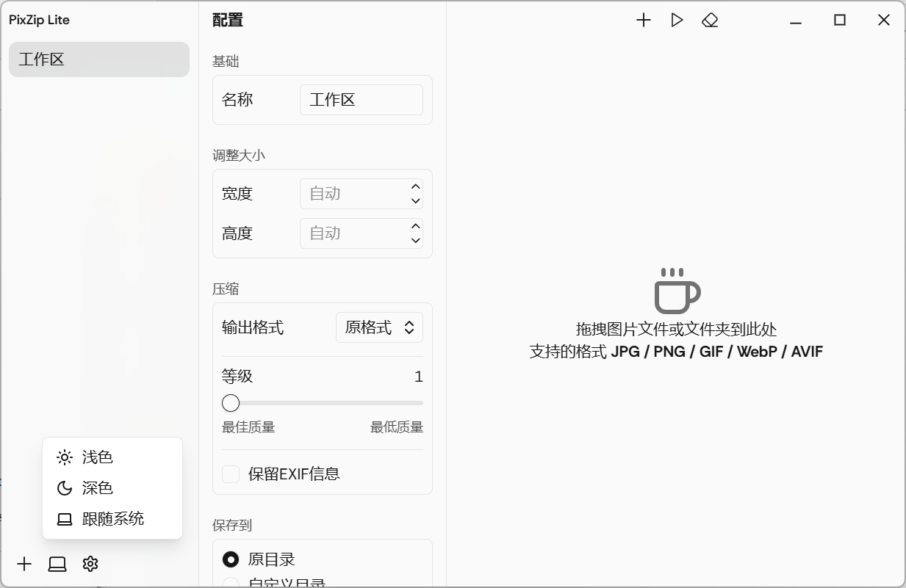
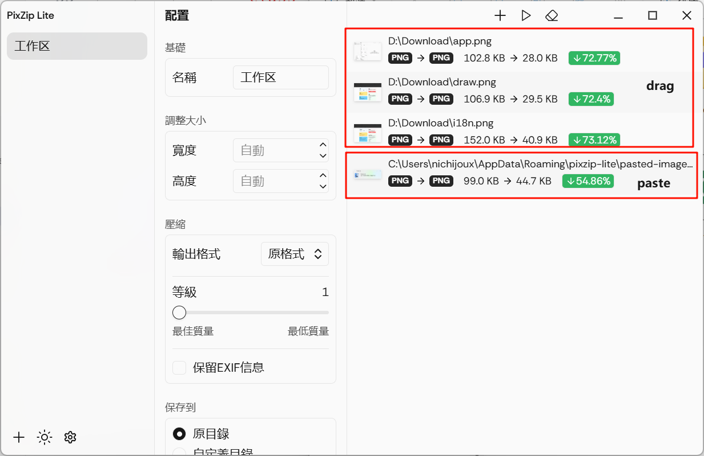
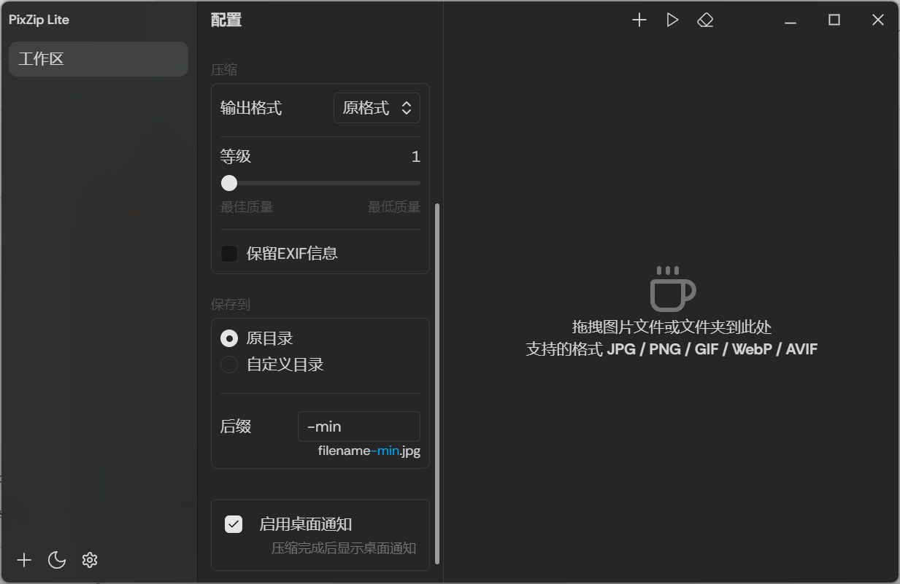
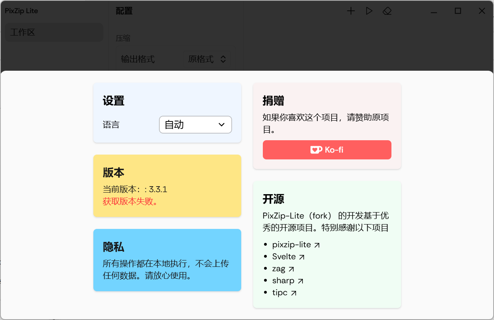
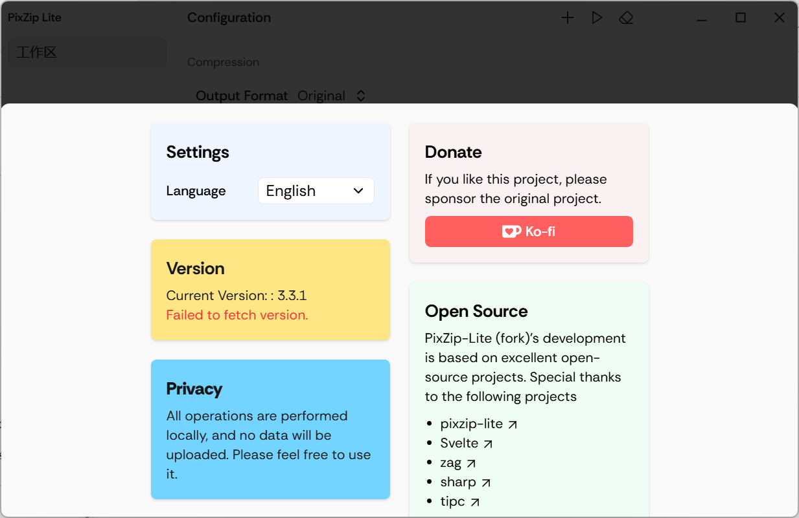

# PixZip Lite（分支版）

> 本项目 Fork 自 [richhost/pixzip-lite](https://github.com/richhost/pixzip-lite)，遵循 MIT 许可证，感谢原作者的开源贡献！

---

中文 | [English](./README_en.md)

## 项目简介

PixZip Lite 是一款基于 Svelte 5 + Electron 的简单易用的批量图片压缩软件，支持 JPG、PNG、WebP、AVIF 等主流格式，适用于 Windows 10+ 和 macOS 12+。

- **界面简洁**：现代化UI，极易上手
- **批量压缩**：支持多图片拖拽、粘贴、批量处理
- **多格式支持**：JPG、PNG、WebP、AVIF
- **空间管理**：可自定义多个压缩空间，独立配置参数
- **系统通知**：压缩完成自动弹窗提醒
- **跨平台**：Windows/macOS
- **高性能**：基于 Node.js、sharp 实现高效压缩

## 主要功能

- 拖拽或粘贴图片导入任务列表
- 多空间（不同压缩配置）
- 图片压缩、尺寸调整与格式转换
- 批量处理与进度通知
- 系统托盘与窗口控制
- 多语言支持（EN/zh-CN/zh-TW）

## 界面预览与功能说明

| 界面 | 说明 |
|---|---|
|  | 应用主界面。 |
|  | 图片压缩功能。 |
|  | 暗黑模式切换，支持一键切换明暗主题。 |
|  | 设置界面。 |
|  | 多语言支持。 |
|  | 通知功能，压缩完成后自动弹出系统通知。 |

## 安装与使用

### 依赖环境
- Node.js 18+
- pnpm（推荐）或 npm

### 安装依赖
```bash
pnpm install
# 或
npm install
```

### 运行开发环境
```bash
pnpm dev
# 或
npm run dev
```

### 打包构建
- Windows:
  ```bash
  pnpm build:win
  ```
- macOS（Apple Silicon）:
  ```bash
  pnpm build:mac:apple
  ```
- macOS（Intel）:
  ```bash
  pnpm build:mac:intel
  ```
- linux :
  ```bash
  pnpm build:linux
  ```

### 常见问题
- macOS 启动报"无法打开未签名应用"，请参考[如何运行未签名App](https://ordonez.tv/2024/11/04/how-to-run-unsigned-apps-in-macos-15-1/)
- 若遇到依赖问题，请确保 Node.js 版本 >= 18，pnpm 版本 >= 8

## 鸣谢与许可证

本项目 Fork 自 [richhost/pixzip-lite](https://github.com/richhost/pixzip-lite)，遵循 MIT 许可证。

感谢原作者的开源贡献！如对本项目有帮助，欢迎 star 原项目。

---

MIT License

