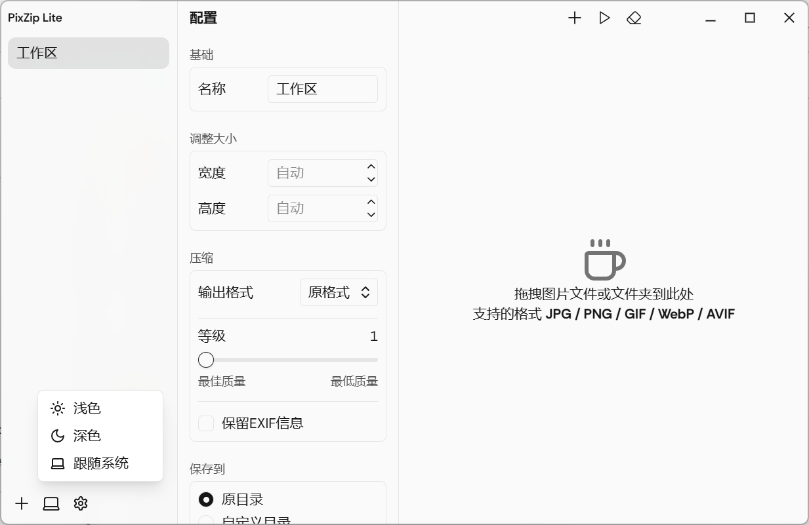
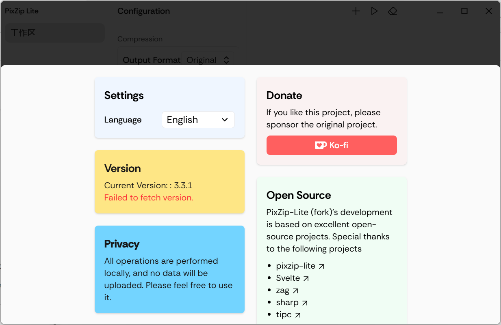

# PixZip Lite (Forked Version)

> This project is forked from [richhost/pixzip-lite](https://github.com/richhost/pixzip-lite), under the MIT license. Thanks to the original author for their open-source contribution!

---

[中文](./README.md) | English

## Introduction

PixZip Lite is a simple and easy-to-use batch image compression software built with Svelte 5 + Electron. It supports mainstream formats such as JPG, PNG, WebP, AVIF, and works on Windows 10+ and macOS 12+.

- **Clean UI**: Modern interface, easy to use
- **Batch Compression**: Drag & drop, paste, and process multiple images at once
- **Multi-format Support**: JPG, PNG, WebP, AVIF
- **Space Management**: Create multiple compression spaces with independent settings
- **System Notification**: Auto popup when compression is done
- **Cross-platform**: Windows/macOS
- **High Performance**: Powered by Node.js and sharp for fast compression

## Main Features

- Drag & drop or paste images to import into the task list
- Multiple spaces (with different compression configs)
- Image compression, resizing, and format conversion
- Batch processing with progress notification
- System tray and window controls
- Multi-language support (EN/zh-CN/zh-TW)

## Interface Preview & Feature Description

| Interface | Description |
|---|---|
|  | Main application. |
|  | Compression feature. |
|  | Dark mode switch, supports toggling between light and dark themes. |
|  | Setting interface. |
|  | Multi-language support interface, indicates support for multiple languages. |
|  | Notification feature, system notification pops up after compression. |

## Installation & Usage

### Requirements
- Node.js 18+
- pnpm (recommended) or npm

### Install dependencies
```bash
pnpm install
# or
npm install
```

### Run in development
```bash
pnpm dev
# or
npm run dev
```

### Build
- Windows:
  ```bash
  pnpm build:win
  ```
- macOS (Apple Silicon):
  ```bash
  pnpm build:mac:apple
  ```
- macOS (Intel):
  ```bash
  pnpm build:mac:intel
  ```
- linux :
  ```bash
  pnpm build:linux
  ```

### FAQ
- On macOS, if you see "can't open unsigned app", see [how to run unsigned apps](https://ordonez.tv/2024/11/04/how-to-run-unsigned-apps-in-macos-15-1/)
- If you encounter dependency issues, make sure Node.js >= 18 and pnpm >= 8

## Acknowledgement & License

This project is forked from [richhost/pixzip-lite](https://github.com/richhost/pixzip-lite) and follows the MIT license.

Thanks to the original author for their open-source work! If you find this project helpful, please consider starring the original repo.

---

MIT License 